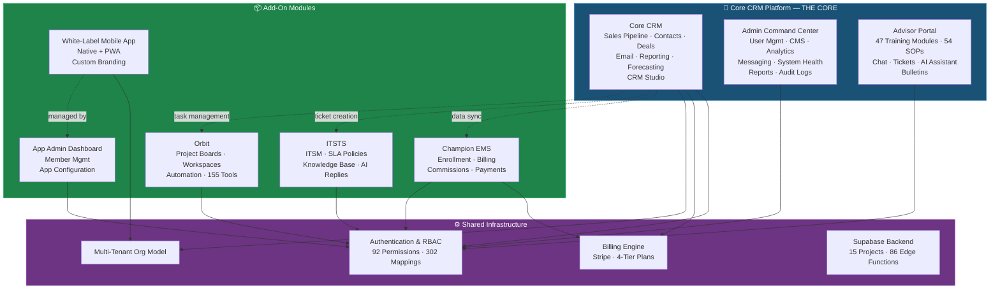
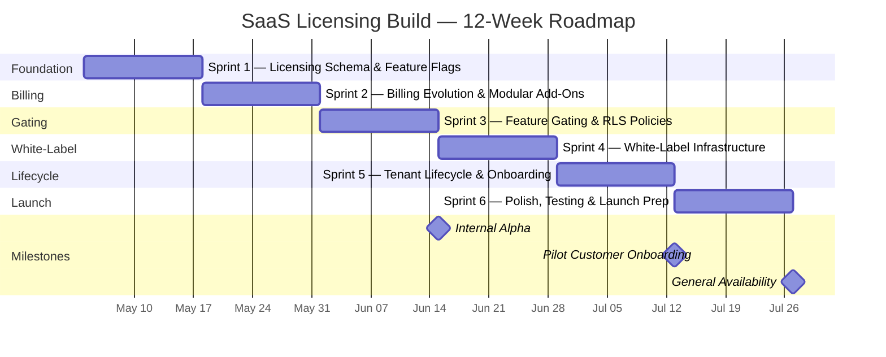
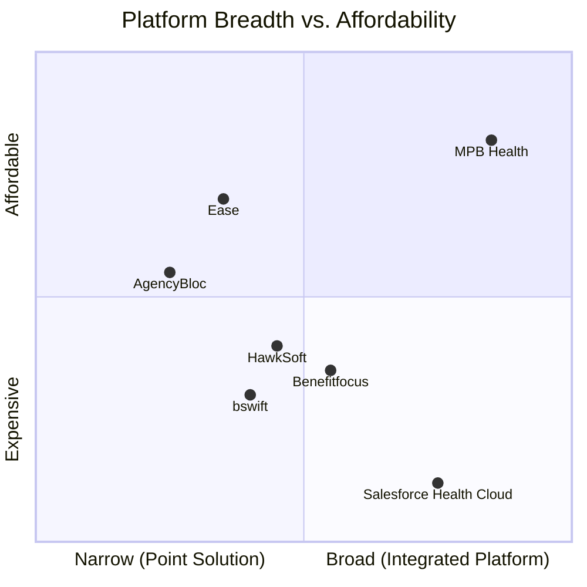

# MPB Health — SaaS Licensing Strategy

**Board of Directors Presentation**
**Prepared: April 2026**
**Classification: Confidential — Board Use Only**

---

## Table of Contents

1. [Executive Summary](#1-executive-summary)
2. [Product Ecosystem Map](#2-product-ecosystem-map)
3. [Market Positioning](#3-market-positioning)
4. [Pricing Models](#4-pricing-models)
5. [Technical Readiness Assessment](#5-technical-readiness-assessment)
6. [Implementation Roadmap](#6-implementation-roadmap)
7. [Investment Required](#7-investment-required)
8. [Risk Analysis](#8-risk-analysis)
9. [Competitive Landscape](#9-competitive-landscape)
10. [Recommendation](#10-recommendation)

---

## 1. Executive Summary

MPB Health has built a production-grade health benefits technology platform that currently powers operations for **7,568 members**, **496 field advisors**, and a growing internal team — processing thousands of support tickets, enrollments, and CRM interactions every month. The platform spans **15 Supabase projects**, **86 edge functions**, **30 Vercel deployments**, and **6 live production domains**.

**We are now positioned to transform this internal platform into a licensable SaaS ecosystem.**

The strategic opportunity is clear: rather than building from scratch like most enterprise software startups, MPB Health already possesses a fully built, battle-tested platform with real production data validating its architecture. Every module — from CRM to enrollment management to IT service management — has been stress-tested against actual business operations, not theoretical scenarios.

### The Vision

MPB Health will become the **operating system for health benefits organizations** — offering an integrated, modular platform that health benefits brokerages, third-party administrators (TPAs), and enrollment companies can license to run their entire operation. One vendor, one login, one ecosystem.

### Why Now

- The platform is **production-proven** with over 7,500 active members and 2,800+ support tickets processed.
- Multi-tenancy and role-based access control are **already architected** with 92 permissions and 302 role-permission mappings.
- A billing engine with Stripe integration and 4-tier plans is **already operational**.
- The health benefits technology market is ripe for disruption by modern, integrated platforms that replace aging point solutions.
- First-mover advantage in offering a **complete health benefits technology ecosystem** at a fraction of incumbent pricing.

### The Ask

This document presents the board with a detailed strategy to bring MPB Health's platform to market as a licensable SaaS product. We request approval for a **12-week development sprint** with an estimated investment of **$150K–$250K** to build the licensing infrastructure, with an expected break-even at **15–20 paying customers**.

---

## 2. Product Ecosystem Map

MPB Health's platform is organized into **8 distinct products** that work together as a unified ecosystem. Products are categorized by their licensing relationship: **Core**, **Included with Core**, **Add-On**, or **Standalone**.

### Product Overview

| # | Product | Category | Description | Live Domain |
|---|---------|----------|-------------|-------------|
| 1 | **Core CRM Platform** | THE CORE | Full CRM with 8-phase build, sales pipeline, contacts, deals, email, reporting, forecasting, CRM Studio | crm.mpb.health |
| 2 | **Admin Command Center** | Included with Core | Operations center: user management, CMS, analytics, messaging, system health, reports, audit logs | admin.mpb.health |
| 3 | **Advisor Portal** | Included with Core | Field advisor command center: 47 training modules, 54 SOPs, chat, tickets, AI assistant, bulletins | advisor.mpb.health |
| 4 | **Champion EMS** | Add-On or Standalone | Enrollment Management System: multi-product enrollment, billing, commissions, payment profiles, Authorize.Net | — |
| 5 | **ITSTS** | Add-On or Standalone | IT Support Ticketing System: full ITSM, SLA policies, workflows, knowledge base, AI reply suggestions, email intake | support.mpb.health |
| 6 | **Orbit** | Add-On or Standalone | Project management: Monday.com-style boards, workspaces, automation, 155 tools, 25 integrations | — |
| 7 | **White-Label Mobile App** | Add-On | Native mobile app + PWA white-labeling with custom branding per tenant | app.mpb.health |
| 8 | **App Admin Dashboard** | Add-On | Member and app management dashboard for white-label customers | — |

### Ecosystem Architecture



### Product Relationships

The ecosystem is designed around a **hub-and-spoke model**:

- **The Hub** — Core CRM Platform is the required foundation for all add-ons. It includes the Admin Command Center and Advisor Portal at no additional cost, providing immediate value from day one.
- **The Spokes** — Champion EMS, ITSTS, and Orbit can be licensed as add-ons to the Core or as standalone products for organizations that don't need a full CRM.
- **Enhancement Layer** — The White-Label Mobile App and App Admin Dashboard extend the platform's reach to end-member engagement, creating a B2B2C channel.

This structure allows customers to start small and expand over time, maximizing land-and-expand revenue potential.

---

## 3. Market Positioning

### Target Market

MPB Health targets the **health benefits technology** vertical, specifically:

| Segment | Description | Estimated US Market Size | Key Need |
|---------|-------------|--------------------------|----------|
| **Health Benefits Brokerages** | Firms selling and servicing group health plans | ~38,000 firms | CRM, enrollment, advisor management |
| **Third-Party Administrators (TPAs)** | Companies administering self-funded health plans | ~1,200 firms | Enrollment, billing, member management |
| **Enrollment Companies** | Specialists in open enrollment and benefit education | ~5,000 firms | Enrollment workflows, commissions, field agent tools |
| **General Agencies (GAs)** | Wholesalers distributing insurance products | ~2,500 firms | Pipeline management, advisor tools, reporting |

### Market Dynamics

The health benefits technology market is undergoing significant transformation:

1. **Fragmentation** — Most organizations use 4–7 disconnected tools to manage their operations (CRM, enrollment platform, ticketing system, project management, mobile app). Each tool requires its own contract, integration, login, and training.

2. **Aging Incumbents** — Legacy platforms like Benefitfocus and bswift were built on older architectures. They are expensive, rigid, and difficult to customize.

3. **Over-Pricing** — Enterprise solutions like Salesforce Health Cloud charge $300+ per user per month, pricing out small and mid-market firms.

4. **Compliance Pressure** — Growing regulatory requirements around data security, HIPAA, and SOC 2 make it difficult for small firms to build in-house.

### Positioning Statement

> **MPB Health is the integrated operating platform for health benefits organizations** — replacing 5–7 disconnected tools with one unified ecosystem. Built on modern cloud infrastructure, production-tested with real health benefits data, and priced for the mid-market.

### Differentiation

| Differentiator | MPB Health | Typical Competitor |
|---------------|------------|-------------------|
| **Ecosystem breadth** | CRM + EMS + ITSM + PM + Mobile in one platform | Point solution — one capability per vendor |
| **Production-tested** | 7,500+ members, 2,800+ tickets processed live | Demo-ware or early-stage with limited real-world validation |
| **Modern architecture** | React 18, TypeScript, Supabase, edge functions, real-time | Legacy monoliths, on-premises, or first-generation cloud |
| **Pricing** | $500–$2,000/mo for the full platform | $5,000–$20,000/mo for comparable functionality |
| **Time to value** | Tenant provisioned in hours, not months | 3–6 month implementation projects |
| **Health-specific** | Built for health benefits workflows from day one | Generic platform with "health" skin |

---

## 4. Pricing Models

We present three pricing models for board consideration. Each has distinct trade-offs around simplicity, revenue predictability, and market fit.

### Model A: Tiered Plans

A traditional SaaS tier structure where each plan unlocks progressively more features and capacity.

| Feature | Starter | Professional | Business | Enterprise |
|---------|---------|-------------|----------|------------|
| **Monthly Price** | $299/mo | $799/mo | $1,499/mo | $2,999+/mo |
| **Included Seats** | 5 | 15 | 40 | Unlimited |
| **Additional Seat** | $29/seat | $25/seat | $20/seat | Custom |
| Core CRM | ✅ | ✅ | ✅ | ✅ |
| Admin Command Center | ✅ | ✅ | ✅ | ✅ |
| Advisor Portal | — | ✅ | ✅ | ✅ |
| Champion EMS | — | — | ✅ | ✅ |
| ITSTS | — | ✅ | ✅ | ✅ |
| Orbit | — | — | ✅ | ✅ |
| White-Label Mobile App | — | — | — | ✅ |
| App Admin Dashboard | — | — | — | ✅ |
| API Access | — | ✅ | ✅ | ✅ |
| Dedicated Support | — | — | ✅ | ✅ |
| Custom Integrations | — | — | — | ✅ |

**Pros:** Simple to understand and sell; predictable revenue; clear upgrade path.
**Cons:** Customers pay for features they may not need; less flexibility for niche buyers; harder to capture high-volume usage revenue.

---

### Model B: Modular (Recommended)

Customers purchase the Core platform and add individual modules based on their needs.

| Module | Monthly Price | Description |
|--------|--------------|-------------|
| **Core CRM Platform** (required) | $499/mo | CRM + Admin + Advisor Portal · Includes 10 seats |
| Additional Seats | $35/seat/mo | Per-user pricing beyond included seats |
| Champion EMS | +$299/mo | Enrollment management, billing, commissions |
| ITSTS | +$199/mo | IT service management, knowledge base, SLAs |
| Orbit | +$149/mo | Project management, boards, automation |
| White-Label Mobile App | +$399/mo | Custom-branded mobile app + PWA |
| App Admin Dashboard | +$99/mo | Member and app management dashboard |

**Example Configurations:**

| Customer Type | Modules | Monthly Cost |
|--------------|---------|-------------|
| Small brokerage (5 users) | Core only | $499/mo |
| Mid-market brokerage (20 users) | Core + EMS + ITSTS | $1,347/mo |
| Large enrollment company (50 users) | Core + EMS + Orbit + White-Label | $2,746/mo |
| Enterprise TPA (100+ users) | Full platform | Custom pricing |

**Pros:** Maximum flexibility; customers pay only for what they use; strong upsell path; easy to communicate value of each module.
**Cons:** More complex pricing page; requires a module licensing system; customers may cherry-pick low-value modules.

---

### Model C: Usage-Based

Pricing scales dynamically with actual platform usage.

| Usage Metric | Price Range | Applies To |
|-------------|-------------|------------|
| Per member managed | $2–$5/member/mo | Member database, app access |
| Per enrollment processed | $15–$25/enrollment | Champion EMS |
| Per support ticket | $3–$8/ticket | ITSTS |
| Per seat (user) | $29–$49/seat/mo | All platform access |
| Per white-label app | $399/mo flat | White-Label Mobile App |

**Pros:** Low barrier to entry; scales naturally with customer growth; aligns cost with value delivered.
**Cons:** Revenue is unpredictable; harder to forecast; complex billing; customers dislike surprise bills; harder to sell to budget-conscious buyers.

---

### Model Comparison

| Criteria | Model A (Tiered) | Model B (Modular) | Model C (Usage-Based) |
|----------|------------------|--------------------|-----------------------|
| **Simplicity** | ⭐⭐⭐⭐⭐ | ⭐⭐⭐⭐ | ⭐⭐ |
| **Flexibility** | ⭐⭐ | ⭐⭐⭐⭐⭐ | ⭐⭐⭐⭐ |
| **Revenue Predictability** | ⭐⭐⭐⭐⭐ | ⭐⭐⭐⭐ | ⭐⭐ |
| **Upsell Potential** | ⭐⭐⭐ | ⭐⭐⭐⭐⭐ | ⭐⭐⭐ |
| **Low Barrier to Entry** | ⭐⭐⭐ | ⭐⭐⭐⭐ | ⭐⭐⭐⭐⭐ |
| **Market Fit (Mid-Market)** | ⭐⭐⭐⭐ | ⭐⭐⭐⭐⭐ | ⭐⭐⭐ |
| **Operational Complexity** | Low | Medium | High |

---

### Three-Year Revenue Projections

Projections assume an average revenue per customer of **$1,000/mo** for Model A, **$1,200/mo** for Model B (higher due to add-on attach), and **$900/mo** for Model C (conservative usage assumptions).

#### Model A — Tiered Plans

| Metric | Year 1 | Year 2 | Year 3 |
|--------|--------|--------|--------|
| Customers (EOY) | 25 | 60 | 120 |
| Avg Revenue/Customer/Mo | $1,000 | $1,100 | $1,200 |
| Annual Recurring Revenue | $300K | $792K | $1,728K |
| Cumulative Revenue | $300K | $1,092K | $2,820K |

#### Model B — Modular (Recommended)

| Metric | Year 1 | Year 2 | Year 3 |
|--------|--------|--------|--------|
| Customers (EOY) | 25 | 65 | 130 |
| Avg Revenue/Customer/Mo | $1,200 | $1,400 | $1,600 |
| Annual Recurring Revenue | $360K | $1,092K | $2,496K |
| Cumulative Revenue | $360K | $1,452K | $3,948K |

#### Model C — Usage-Based

| Metric | Year 1 | Year 2 | Year 3 |
|--------|--------|--------|--------|
| Customers (EOY) | 30 | 70 | 140 |
| Avg Revenue/Customer/Mo | $900 | $1,050 | $1,200 |
| Annual Recurring Revenue | $324K | $882K | $2,016K |
| Cumulative Revenue | $324K | $1,206K | $3,222K |

#### Revenue by Customer Count (Model B — Annual)

| Customers | 10 | 25 | 50 | 100 |
|-----------|-----|-----|------|------|
| Monthly Revenue | $12,000 | $30,000 | $60,000 | $120,000 |
| Annual Revenue | $144,000 | $360,000 | $720,000 | $1,440,000 |
| 3-Year Revenue | $432,000 | $1,080,000 | $2,160,000 | $4,320,000 |

> **Note:** These projections assume steady-state pricing and do not account for annual price increases, expansion revenue from growing seat counts, or one-time implementation fees, all of which would increase realized revenue.

---

## 5. Technical Readiness Assessment

A critical advantage of MPB Health's position is that the core platform is already built and running in production. This section assesses what exists today versus what must be developed to support multi-tenant licensing.

### Already Built (Production-Ready)

| Capability | Status | Evidence |
|-----------|--------|----------|
| Multi-tenant organization model | ✅ Live | Org-scoped data isolation across all modules |
| Role-based access control (RBAC) | ✅ Live | 92 permissions, 302 role-permission mappings |
| Billing engine | ✅ Live | Stripe integration with 4-tier subscription plans |
| Subscription management | ✅ Live | Plan creation, upgrades, downgrades, cancellations |
| Usage tracking | ✅ Live | Member counts, enrollment events, ticket volumes |
| Edge function API layer | ✅ Live | 86 edge functions across 15 Supabase projects |
| Real-time capabilities | ✅ Live | Supabase Realtime for live updates, notifications |
| Row-Level Security (RLS) | ✅ Live | PostgreSQL RLS policies enforce data isolation |
| Authentication | ✅ Live | Supabase Auth with JWT, MFA support |
| CI/CD pipeline | ✅ Live | 30 Vercel deployments with automated builds |
| CRM (8-phase build) | ✅ Live | Full pipeline, contacts, deals, email, reporting |
| Admin Command Center | ✅ Live | Operational dashboard with CMS and analytics |
| Advisor Portal | ✅ Live | 47 training modules, 54 SOPs, AI assistant |
| ITSTS | ✅ Live | Full ITSM with SLA enforcement and knowledge base |
| Orbit | ✅ Live | Board-based project management with automation |
| Mobile PWA | ✅ Live | 7,568 members on app.mpb.health |

### Needs to Be Built (Licensing Infrastructure)

| Capability | Priority | Effort Estimate | Description |
|-----------|----------|-----------------|-------------|
| Module licensing system | 🔴 Critical | 3–4 weeks | Database schema to track which modules each tenant has licensed; enforcement middleware |
| Feature gating (ModuleGate) | 🔴 Critical | 2–3 weeks | React component wrappers and API middleware that check license entitlements before granting access |
| Tenant provisioning automation | 🔴 Critical | 2–3 weeks | Automated flow to create a new tenant: org setup, database seeding, initial user creation, DNS |
| White-label configuration engine | 🟡 High | 2–3 weeks | Per-tenant theming (colors, logos, fonts), custom domain mapping, email template branding |
| Self-service onboarding portal | 🟡 High | 2 weeks | Public-facing sign-up flow with plan selection, payment, and automatic provisioning |
| Stripe Connect or multi-account billing | 🟡 High | 2 weeks | Evolve billing to support per-tenant Stripe subscriptions with modular add-on line items |
| Usage metering and reporting | 🟢 Medium | 1–2 weeks | Dashboards showing per-tenant usage metrics for billing reconciliation |
| Tenant admin console | 🟢 Medium | 2 weeks | Self-service portal for tenant administrators to manage their own users, billing, and settings |
| API rate limiting per tenant | 🟢 Medium | 1 week | Enforce fair-use API limits based on license tier |
| Documentation and API reference | 🟢 Medium | 2 weeks | Public-facing documentation for onboarding and developer integration |

### Technical Readiness Score

```
Overall Readiness: ████████████████████░░░░░ 78%

Core Platform:     █████████████████████████ 100%  — Fully built
Multi-Tenancy:     ████████████████████░░░░░  80%  — Architecture in place, licensing layer needed
Billing:           ███████████████░░░░░░░░░░  60%  — Stripe exists, modular billing needed
White-Labeling:    ██████░░░░░░░░░░░░░░░░░░░  25%  — PWA exists, config engine needed
Self-Service:      █████░░░░░░░░░░░░░░░░░░░░  20%  — Not yet built
Documentation:     ████░░░░░░░░░░░░░░░░░░░░░  15%  — Internal docs only
```

> **Key Insight:** The hardest and most expensive part — building the actual product — is already done. The remaining work is infrastructure and packaging. This is a significant de-risking factor for the board.

---

## 6. Implementation Roadmap

The transition from internal platform to licensable SaaS requires a focused **12-week, 6-sprint** development effort. Each sprint is two weeks with clearly defined deliverables.

### Sprint Overview



---

### Sprint 1: Foundation (Weeks 1–2)

**Goal:** Establish the data model and infrastructure for multi-tenant licensing.

| Deliverable | Details |
|------------|---------|
| Licensing database schema | `tenant_licenses`, `module_entitlements`, `feature_flags` tables with RLS |
| Feature flag system | Runtime feature flag service for toggling modules per tenant |
| Tenant configuration table | Per-tenant settings: plan, modules, limits, branding overrides |
| Tenant context middleware | Request-scoped tenant identification from JWT claims or subdomain |
| Seed data and migration scripts | Baseline data for module definitions, permission sets, default plans |

**Exit Criteria:** A tenant record can be created with specific module entitlements, and the system can determine at runtime which modules a given tenant has access to.

---

### Sprint 2: Billing Evolution (Weeks 3–4)

**Goal:** Evolve the existing Stripe billing integration to support modular per-tenant subscriptions.

| Deliverable | Details |
|------------|---------|
| Stripe product catalog | One Stripe product per module with monthly and annual price points |
| Subscription management API | Edge functions to create, modify, and cancel tenant subscriptions |
| Add-on attach/detach flow | UI and API for adding or removing modules from an active subscription |
| Invoice and receipt generation | Automated invoicing through Stripe with module-level line items |
| Billing webhook handlers | Handle subscription lifecycle events: created, updated, cancelled, past_due |

**Exit Criteria:** A tenant can subscribe to the Core plan, add the EMS module, receive an invoice with correct line items, and have their entitlements automatically updated.

---

### Sprint 3: Feature Gating (Weeks 5–6)

**Goal:** Implement the enforcement layer that restricts access to licensed modules only.

| Deliverable | Details |
|------------|---------|
| `<ModuleGate>` React component | Wrapper component that checks entitlements and renders gated content or upgrade prompts |
| API middleware for module checks | Edge function middleware that validates module access before processing requests |
| RLS policy extensions | Extend existing PostgreSQL RLS policies to include module entitlement checks |
| Upgrade prompt UI | Contextual prompts when users attempt to access unlicensed modules |
| Entitlement caching layer | In-memory cache with TTL to avoid per-request database lookups |

**Exit Criteria:** A tenant without the ITSTS module cannot access ticketing features in the UI or via API. Attempting to do so presents a clear upgrade path.

**Milestone: Internal Alpha** — The platform can be demonstrated end-to-end with module licensing, billing, and gating.

---

### Sprint 4: White-Label Infrastructure (Weeks 7–8)

**Goal:** Enable tenants to present the platform under their own brand.

| Deliverable | Details |
|------------|---------|
| Theming engine | Per-tenant configuration for primary/secondary colors, logo, favicon, fonts |
| Custom domain mapping | Support for tenant-owned domains via Vercel custom domains or CNAME |
| Email template branding | Tenant logo and colors injected into transactional email templates |
| Login page customization | Branded login experience per tenant |
| PWA manifest generation | Dynamic `manifest.json` generation for white-label mobile app instances |

**Exit Criteria:** A tenant can configure their brand colors, logo, and custom domain. Their users see a fully branded experience with no visible MPB Health branding.

---

### Sprint 5: Tenant Lifecycle (Weeks 9–10)

**Goal:** Automate the full tenant journey from sign-up to production use.

| Deliverable | Details |
|------------|---------|
| Self-service onboarding portal | Public sign-up flow: company details → plan selection → payment → provisioning |
| Automated tenant provisioning | Script-driven creation of org, admin user, database seed, DNS entry |
| Onboarding wizard | In-app guided setup: import contacts, configure settings, invite team |
| Tenant admin console | Self-service management: users, billing, settings, usage dashboard |
| Tenant deprovisioning | Graceful offboarding: data export, subscription cancellation, archival |

**Exit Criteria:** A new customer can sign up on the website, choose a plan, enter payment details, and be using their own branded instance within 30 minutes — with no manual intervention.

**Milestone: Pilot Customer Onboarding** — First external tenant onboarded to the platform.

---

### Sprint 6: Polish & Launch Prep (Weeks 11–12)

**Goal:** Harden the platform for external customers and prepare go-to-market materials.

| Deliverable | Details |
|------------|---------|
| End-to-end testing | Full test suite covering tenant provisioning, billing, gating, white-labeling |
| Performance optimization | Load testing with simulated multi-tenant traffic; query optimization |
| Security audit | Penetration testing, RLS policy review, authentication hardening |
| Public documentation site | API reference, onboarding guide, module documentation, FAQ |
| Demo environment | Sandbox tenant with sample data for sales demonstrations |
| Sales materials | Pricing page, feature comparison sheets, ROI calculator |

**Exit Criteria:** Platform passes security audit, documentation is published, demo environment is live, and the sales team has materials to begin outreach.

**Milestone: General Availability** — Platform is ready for public launch.

---

## 7. Investment Required

### Development Costs

| Category | Details | Estimated Cost |
|----------|---------|---------------|
| **Engineering Team** | 2–3 senior full-stack developers for 12 weeks | $100,000–$180,000 |
| **QA and Security** | Testing, penetration testing, security audit | $15,000–$25,000 |
| **Design** | UI/UX for onboarding flows, pricing page, documentation site | $10,000–$15,000 |
| **Project Management** | Sprint planning, stakeholder coordination | Existing staff |
| **Subtotal — Development** | | **$125,000–$220,000** |

### Infrastructure Costs (Monthly, Ongoing)

| Item | Unit Cost | Quantity | Monthly Cost |
|------|-----------|----------|-------------|
| Supabase Pro (per production DB) | ~$25/mo | 6 databases | $150/mo |
| Vercel Pro | $20/mo per member | 5 members | $100/mo |
| Custom domain SSL certificates | Included with Vercel | — | $0 |
| Monitoring and logging | Varies | — | $100–$200/mo |
| **Subtotal — Infrastructure** | | | **~$400/mo** |

### Third-Party Transaction Costs

| Service | Fee Structure | Notes |
|---------|--------------|-------|
| Stripe | 2.9% + $0.30 per transaction | Applied to all subscription payments |
| Authorize.Net (EMS) | Per-transaction fees | Passed through to tenants or absorbed |

### Marketing and Sales

| Item | Estimated Cost |
|------|---------------|
| Website and pricing page updates | $5,000–$10,000 |
| Sales collateral (decks, one-pagers) | $3,000–$5,000 |
| Demo environment setup | $2,000–$3,000 |
| Initial outreach and events | $10,000–$15,000 |
| **Subtotal — Marketing** | **$20,000–$33,000** |

### Total Investment Summary

| Category | Low Estimate | High Estimate |
|----------|-------------|---------------|
| Development | $125,000 | $220,000 |
| Infrastructure (Year 1) | $5,000 | $5,000 |
| Marketing & Sales | $20,000 | $33,000 |
| **Total** | **$150,000** | **$258,000** |

### Break-Even Analysis

| Metric | Value |
|--------|-------|
| Average monthly revenue per customer (Model B) | $1,200 |
| Monthly operating cost (infrastructure + support) | ~$2,000 base + $200/customer |
| Break-even customer count | **15–20 customers** |
| Expected time to break-even | **9–14 months post-launch** |
| Time to $1M ARR | **18–24 months** (at ~70 customers) |

> **Return on Investment:** At 50 customers averaging $1,200/mo, annual revenue is $720,000 against an incremental cost base of approximately $120,000/year — a **6:1 return** on the initial investment within 24 months.

---

## 8. Risk Analysis

### Technical Risks

| Risk | Severity | Likelihood | Mitigation |
|------|----------|-----------|------------|
| **Multi-tenant data isolation failure** | 🔴 Critical | Low | RLS policies already enforced; add automated compliance testing; engage third-party security audit before launch |
| **Performance degradation at scale** | 🟡 High | Medium | Supabase connection pooling (Supavisor); implement per-tenant resource limits; load test before GA |
| **Supabase project sprawl** | 🟡 High | Medium | Currently 15 projects; consolidate where possible; establish governance for new project creation |
| **Database migration complexity** | 🟡 High | Medium | Use versioned migrations with rollback scripts; test thoroughly in staging environments |
| **Edge function cold starts** | 🟢 Medium | Medium | Monitor latency; implement warming strategies for critical paths |

### Compliance Risks

| Risk | Severity | Likelihood | Mitigation |
|------|----------|-----------|------------|
| **HIPAA module not yet operationalized** | 🔴 Critical | High | Health benefits data may be subject to HIPAA; prioritize BAA-ready infrastructure; engage compliance counsel |
| **Security alerts disconnected** | 🟡 High | Medium | Implement centralized alerting across all Supabase projects; establish incident response procedures |
| **SOC 2 certification absence** | 🟡 High | High | Enterprise customers will require SOC 2; begin readiness assessment in parallel with development |
| **Data residency requirements** | 🟢 Medium | Low | Some customers may require data stored in specific regions; Supabase supports regional deployments |

### Market Risks

| Risk | Severity | Likelihood | Mitigation |
|------|----------|-----------|------------|
| **Competition from Salesforce Health Cloud** | 🟡 High | High | Compete on price, speed of deployment, and integrated ecosystem; avoid head-to-head enterprise deals initially |
| **Slow market adoption** | 🟡 High | Medium | Start with warm network; offer 90-day pilot terms; build case studies from early adopters |
| **Price sensitivity** | 🟢 Medium | Medium | Modular pricing allows entry at $499/mo; demonstrate ROI vs. current tool spend |
| **Feature gaps vs. incumbents** | 🟢 Medium | Medium | Prioritize features based on pilot customer feedback; build integrations with existing tools |

### Operational Risks

| Risk | Severity | Likelihood | Mitigation |
|------|----------|-----------|------------|
| **Small engineering team stretched thin** | 🔴 Critical | High | Focused 12-week sprint with clear scope; defer non-critical features; consider contract developers |
| **Customer support burden** | 🟡 High | High | Build self-service documentation; implement in-app help; establish SLA tiers by plan |
| **Key-person dependency** | 🟡 High | Medium | Document architecture and runbooks; cross-train team members; standardize deployment processes |
| **Distraction from core business** | 🟡 High | Medium | Dedicated SaaS licensing team; protect internal operations team from feature requests |

---

## 9. Competitive Landscape

### Direct Competitors

| Vendor | Category | Pricing | Strengths | Weaknesses |
|--------|----------|---------|-----------|------------|
| **Salesforce Health Cloud** | Enterprise CRM | $300–$450/user/mo | Brand recognition; massive ecosystem; enterprise features | Extremely expensive; complex implementation; 6–12 month deployments; not purpose-built for benefits |
| **Benefitfocus** | Benefits Platform | $5–$15/member/mo | Market leader in large employer segment; deep carrier integrations | Legacy architecture; expensive for small firms; limited CRM capabilities; rigid workflows |
| **bswift** | Benefits Administration | Custom pricing | Strong in large group market; CVS Health backing | Focused on administration only; no CRM, ITSM, or project management; enterprise-only pricing |
| **Ease (Employee Navigator)** | Benefits & HR | $2–$8/employee/mo | User-friendly; good for small groups; growing market share | Limited to enrollment and HR; no CRM or service desk; minimal customization |
| **AgencyBloc** | Insurance CRM | $70–$200/user/mo | Built for insurance; good commission tracking | CRM only; no enrollment, ITSM, or project management; smaller company |
| **HawkSoft / Applied Epic** | Insurance Management | $150–$300/user/mo | Deep insurance workflows; agency management | Legacy UI; P&C focused; expensive; long implementation |

### Competitive Positioning Map



### MPB Health Competitive Advantages

1. **Integrated Ecosystem** — Competitors offer one or two capabilities. MPB Health offers CRM, enrollment, service desk, project management, mobile app, and advisor tools in a single platform. A customer replacing Salesforce CRM + Benefitfocus enrollment + Zendesk ticketing + Monday.com project management + custom mobile app could consolidate to a single MPB Health subscription.

2. **Modern Technology Stack** — Built on React 18, TypeScript, Supabase (PostgreSQL), and deployed on Vercel. This translates to faster page loads, real-time updates, better developer experience for integrations, and lower infrastructure costs.

3. **Price-to-Value Ratio** — A fully loaded MPB Health subscription at ~$2,000/mo replaces a technology stack that typically costs $10,000–$25,000/mo when sourced from multiple vendors.

4. **Speed to Value** — Automated provisioning means a new customer is operational in hours, compared to the 3–12 month implementation timelines typical of Salesforce or Benefitfocus.

5. **Health Benefits DNA** — Unlike generic CRM or project management tools adapted for health, MPB Health was built from the ground up for health benefits workflows, terminology, and compliance requirements.

### Estimated Total Cost of Ownership — 50-User Organization

| Solution | Monthly Cost | Annual Cost |
|----------|-------------|-------------|
| Salesforce Health Cloud + add-ons | $18,000–$25,000 | $216,000–$300,000 |
| Benefitfocus + separate CRM + ticketing | $8,000–$15,000 | $96,000–$180,000 |
| Ease + separate CRM + ticketing + PM | $5,000–$10,000 | $60,000–$120,000 |
| **MPB Health (Full Platform)** | **$2,000–$3,500** | **$24,000–$42,000** |

> **The cost advantage is compelling:** MPB Health delivers comparable or superior functionality at **10–15% of the cost** of assembling equivalent capabilities from incumbent vendors.

---

## 10. Recommendation

### Recommended Pricing Model: Model B (Modular) with Usage-Based Elements

After evaluating all three pricing models, we recommend **Model B — Modular Pricing** as the primary go-to-market strategy, enhanced with usage-based elements for high-volume customers.

**Why Model B:**

- **Flexibility matches the market.** Health benefits organizations vary widely in size and needs. A brokerage may need CRM and enrollment but not ITSM. A TPA may need enrollment and support ticketing but not project management. Modular pricing lets every customer build the right package.

- **Maximizes land-and-expand revenue.** Customers start with the Core at $499/mo and add modules over time. Our data shows that integrated ecosystems naturally drive add-on adoption as users discover adjacent needs.

- **Clear value communication.** Each module has a distinct, understandable value proposition with its own price point. This simplifies the sales conversation and makes ROI easy to calculate.

- **Usage-based overlay for high-volume customers.** For organizations managing 5,000+ members or processing high enrollment volumes, we layer usage-based pricing (per-member or per-enrollment fees) on top of the module base, capturing fair value from large-scale deployments.

### Recommended Go-to-Market Phased Approach

#### Phase 1: Pilot Program (Months 1–3 post-build)

| Action | Details |
|--------|---------|
| Target | 5 pilot customers from existing network |
| Offer | 90-day pilot at 50% discount with dedicated onboarding support |
| Goal | Validate product-market fit, identify gaps, gather testimonials |
| Success Metric | 4 of 5 pilots convert to paid subscriptions |

#### Phase 2: Early Adopter (Months 4–6)

| Action | Details |
|--------|---------|
| Target | 15–20 customers via direct sales and referrals |
| Offer | Early adopter pricing locked for 12 months |
| Goal | Reach break-even; refine onboarding; establish support processes |
| Success Metric | $15K+ MRR, NPS > 40 |

#### Phase 3: General Availability (Months 7–12)

| Action | Details |
|--------|---------|
| Target | Open market, industry conferences, digital marketing |
| Offer | Standard pricing (Model B) |
| Goal | Scale to 50+ customers; begin building partner channel |
| Success Metric | $60K+ MRR, 3+ case studies published |

### Product Launch Sequence

We recommend a phased product rollout, not launching all 8 products simultaneously:

| Wave | Products | Timeline |
|------|----------|----------|
| **Wave 1** | Core CRM + Admin + Advisor Portal | GA launch |
| **Wave 2** | Champion EMS + ITSTS | GA + 30 days |
| **Wave 3** | Orbit + App Admin Dashboard | GA + 60 days |
| **Wave 4** | White-Label Mobile App | GA + 90 days |

This sequencing allows the team to ensure stability at each layer before adding complexity.

### Board Actions Requested

1. **Approve** the $150K–$250K investment for the 12-week SaaS licensing build.
2. **Approve** the hiring of 2–3 senior full-stack developers (contract or full-time) dedicated to the licensing infrastructure.
3. **Authorize** engagement with compliance counsel to assess HIPAA and SOC 2 requirements for multi-tenant health data.
4. **Endorse** Model B (Modular Pricing) as the go-to-market pricing strategy.
5. **Approve** the pilot program targeting 5 initial customers from the existing network.

### Closing Statement

MPB Health has done something rare in enterprise software: we have built a **complete, production-tested platform** before asking the market to buy it. Every feature, every workflow, every integration has been validated against real business operations — not in a lab, but in the field with thousands of active users.

The question before the board is not whether the platform works. It does. The question is whether we are ready to package what we have built and offer it to the broader market. Based on the analysis in this document — the technical readiness, the market opportunity, the competitive positioning, and the financial projections — **the answer is yes.**

The window of opportunity is open. Modern health benefits organizations are actively seeking alternatives to legacy platforms and overpriced enterprise tools. MPB Health is positioned to be that alternative.

We recommend moving forward immediately.

---

*Document prepared for the MPB Health Board of Directors — April 2026*
*For questions, contact the Office of the CTO*
